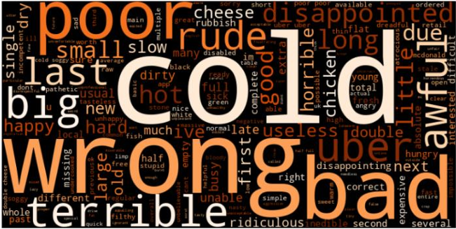
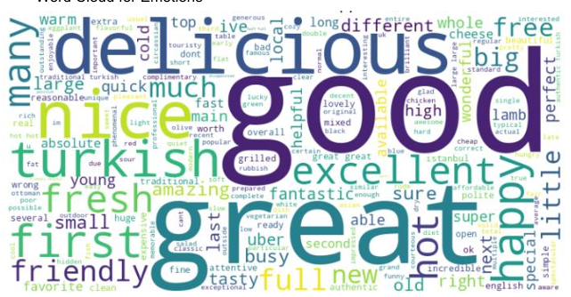

# Understanding Customer Preferences Through Emotion Annotation
## Project Overview
This project analyzes customer reviews to predict emotions using Python NLP and NLTK libraries.

## Steps
1. Data collection by scraping Yelp and Trustpilot websites for customer reviews.
2. Data cleaning and preprocessing.
3. Manually annotated over 4k reviews, focused on the 5 distinct emotions.
4. Measure Inter-Annotator Agreement with Cohen Kappa's Test.
5. Create an emotion dictionary for emotions.
6. Automatic annotation of over 18k reviews with a custom function in Python.
7. EDA to gain insights into the spread of emotions.
8. Train a machine-learning model for emotion prediction.

## Technologies
- Python (Requests, BeautifulSoup, NLTK, Pandas, NumPy, Scikit Learn)
- MS Excel for manual annotation

## Outcome
- Created an annotated dataset of over 20k reviews.
- Delivered actionable insights for improving customer satisfaction.

## Visualizations

### 2. Word Cloud for Negative Reviews

### 3. Word Cloud for Positive Reviews

## How to Run
- Clone this repository.
- Install the required libraries using `requirements.txt`.
- Run `notebook.ipynb`.

